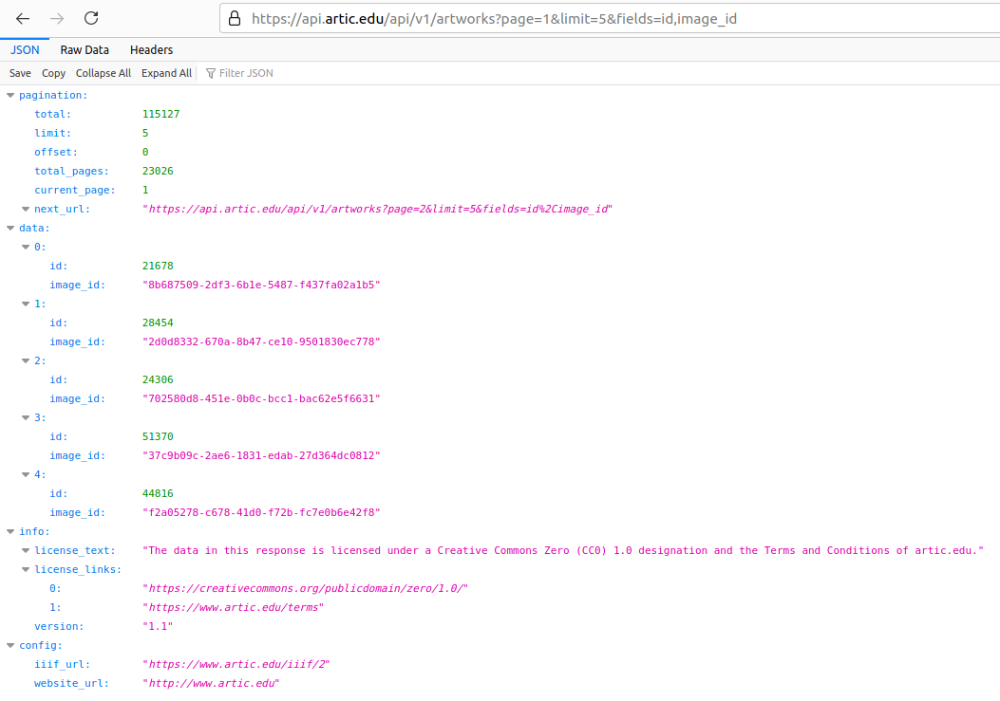

# ArtGallery


[	или см. демо-видео на YouTube](https://youtu.be/lNEu-WLmf2M)

## Art Institute of Chicago API

​		В данном приложении используется общедоступный Art Institute of Chicago API (см. http://api.artic.edu/docs/#quick-start), с помощью которого можно получить информацию о предметах искусства в формате JSON. Для получения этих данных я использую Retrofit и Gson.

​	Для получения изображения необходимо знать image_id, запрос выглядит следующим образом:


​	С помощью этого идентификатора и фреймворка Glide эти изображения загружаются с шириной в 200px.

​	Общий формат такой:

```
https://www.artic.edu/iiif/2/{identifier}/full/{width},/0/default.jpg
```

​	Рекомендуется использовать такие разрешения, но, стоит иметь ввиду, что оригиналы, зачастую, имеют большее разрешение:
```
https://www.artic.edu/iiif/2/{identifier}/full/200,/0/default.jpg
https://www.artic.edu/iiif/2/{identifier}/full/400,/0/default.jpg
https://www.artic.edu/iiif/2/{identifier}/full/600,/0/default.jpg
https://www.artic.edu/iiif/2/{identifier}/full/843,/0/default.jpg
https://www.artic.edu/iiif/2/{identifier}/full/1686,/0/default.jpg
```

###### 	Не каждый предмет имеет изображение и в таком случае они игнорируются.

###### 	Чем больше разрешение, тем дольше загрузка изображений, поэтому я использовал самый оптимальный вариант с шириной в 200px.

## RoadMap

- [x] Перевод программы на Room, ViewModel, RxJava (может LiveData).

* Добавка настроек, с возможностью изменения типа масштабирования(по умолчанию используется fitXY), размера сетки, качества изображений.
* Добавление нового фрагмента, который позволит получить дополнительную информацию о изображении: описание, год создания, автора и тп.
* Вкладка - избранное, которая позволит наслаждаться произведениями искусства, если отстутствует интернет.

